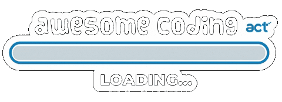
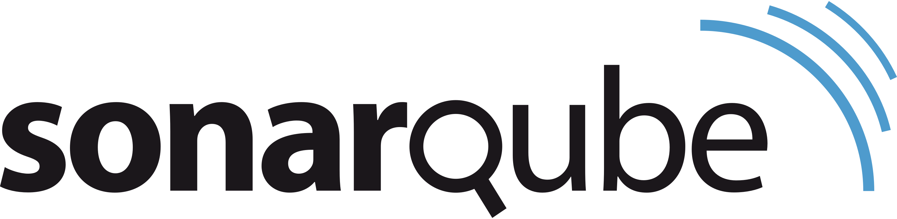

### Hi, Susanna here! 🪂

 

#### 🧭 A little about me:
- 👩‍💻 Backend | DevOps developer based in Italy
- 🙋‍♀️ Pronouns: She / Her
- 🎓 I’m currently learning: C++
- ⚡ Favourite quote: "The game is afoot!"
- 💫 Hobbies: 📖 read novels, 🕵️‍♀️ solve enigmas, 🖥 writing awesome code, 🌍 explore the metaverse

 

#### 📫 How to reach me:
 &nbsp; &nbsp; 
  
#### 👨🏻‍💻 Languages and Tools
         